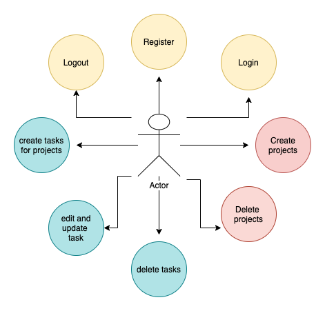
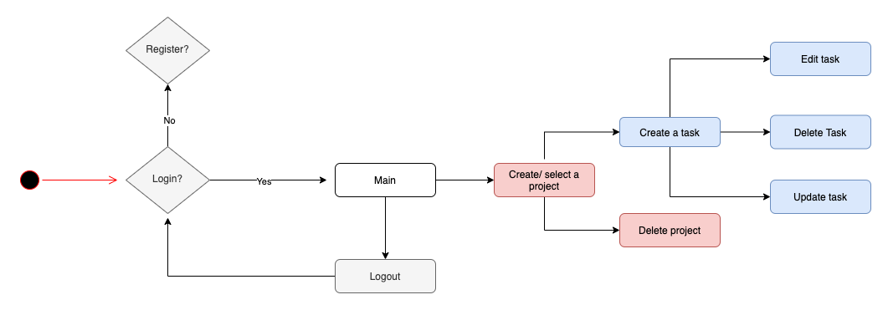
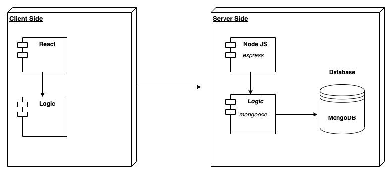
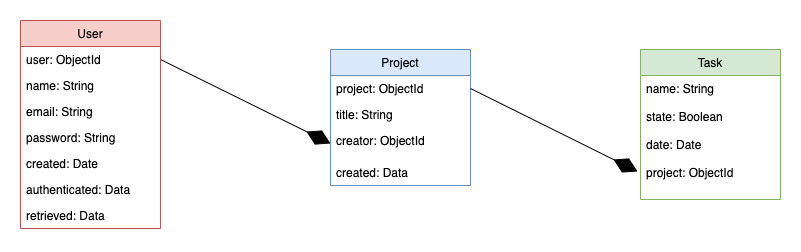

# MERNTASK

## DESCRIPTION
MernTask is an application to easily manage projects and personal tasks.

This project is part of a great course by Juan Pablo De la Torre Valdez that I have done. It's not exactly like Juan Pablo did it because I wanted to use the skills I learned in my bootcamp so I used fecht api instead of axios api ... and a few more skills.

### Use Cases

### Work Flow

## Technical Description

### Blocks

### Data Model

## Technologies
JavaScript, React Hooks, Node.js, Express, MongoDB, Mongoose

## TO DO
Improve some inputs:

- Error handle in taskState.
- After logout project still selected. Should be null!
- The High Order Component if avoid the flash does not protect the Component correctly